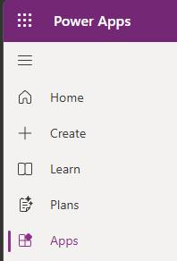
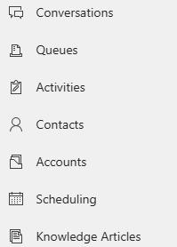
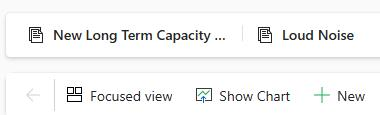
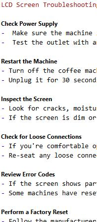
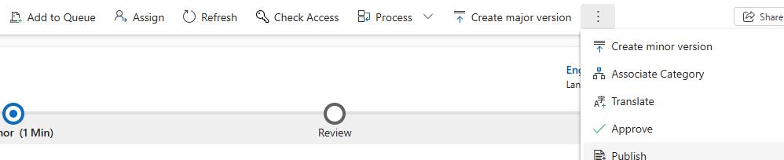
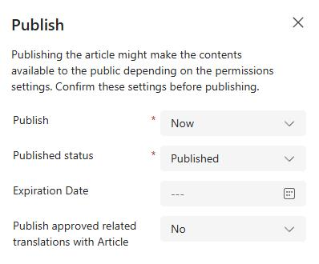

## Task 01: Create a knowledge article about LCD screens


As part of the Contoso sample data that has been deployed, you should have multiple knowledge articles that are deployed and published. In this task, you're going to be creating a specific knowledge article that you'll be attaching to a specific intent later.

1. In Edge, go to `https://make.powerapps.com/`. 

1. At the top right of the page, select your demo environment.

1. In the left pane, select **Apps**.

	

1. Locate the **Copilot Service Workspace** app and then select **Play** (the triangle icon).

	

1. At the tope left of the page, select **Site map** and then select **Knowledge Articles**.

    
    

1. On the command bar, select **+ New**.

	

1. Configure the knowledge article by using the following information:

    | Option | Value |
    | -------- | -------- |
	| Title: | `LCD Screen is not working` |
    | Keywords: | `LCD, Blank, Airpot, Troubleshoot` |
    | Description: | `Instructions for troubleshooting steps when the customer is having an issue with their LCD screen on their machine.` |

1. Paste the following text into the **Content** text editor:


    ```
    If the customer is having issues with their LCD screen on their device, follow the instructions  below to assist with troubleshooting.

    LCD Screen Troubleshooting Steps

    Check Power Supply
    -  Make sure the machine is plugged in securely.
    -  Test the outlet with another device to confirm it's working.

    Restart the Machine
    - Turn off the coffee machine.
    - Unplug it for 30 seconds, then plug it back in and power on.

    Inspect the Screen
    - Look for cracks, moisture, or discoloration.
    - If the screen is dim or flickering, it could be a backlight issue.

    Check for Loose Connections
    - If you're comfortable opening the machine, inspect internal cables to the LCD.
    - Re-seat any loose connectors carefully.

    Review Error Codes
    - If the screen shows partial info or codes, check the user manual for meanings.
    - Some machines have reset sequences you can try.

    Perform a Factory Reset
    - Follow the manufacturer's instructions to reset the machine.
    - This can resolve software glitches affecting the display.

    Update Firmware (if applicable)
    - Some smart coffee machines allow firmware updates via app or USB.
    - Check the brand's support site for instructions.
    ```


1. Apply bold font to the titles for each of the seven lists.

	

1. On the command bar, select **Save**.

1. On the command bar, select **Publish**.

	{: .warning }
    > You may need to select the vertical ellipses (**...**) to see the **Publish** option.

    

1. Configure the publication by using the following values and then select **Publish**:

    | Option | Value |
    | -------- | -------- |
    | Publish: | **Now** |
    | Published status: | **Published** |
    | Expiration Date: | Leave blank |

    
	

1. Leave the page open. You will create a new knowledge article in the next task.