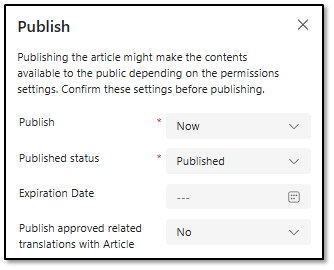

## Task 02: Create a knowledge article for poor tasting coffee


1. On the **Knowledge article** page, on the command bar, select **+ New**.

1. Configure the knowledge article by using the following information:

    | Option | Value |
    | -------- | -------- |
    | Title: | `Poor Tasting Coffee` |
    | Keywords: | `Taste, Bitter, Airpot, Troubleshoot` |
    | Description: | `Instructions for troubleshooting steps when the customer is reaches out about a poor taste with their coffee`. |

1. Paste the following text into the **Content** text editor:

    ```
    If a customer is complaining about a poor taste with their coffee, follow the steps below to troubleshoot the device.

    Troubleshooting Poor Coffee Taste


   Clean the Machine

    - Run a cleaning cycle or use a descaling solution.
    - Clean the brew head, water reservoir, and any milk frothing parts.

    Check Water Quality

    - Use filtered or bottled water if your tap water tastes off.
    - Avoid distilled water-it lacks minerals that help extract flavor.

    Inspect Coffee Beans or Grounds

    - Make sure beans are fresh (not oily or stale).
    - Store them in an airtight container away from light and heat.
    - If using pre-ground coffee, check the grind size-too fine or too coarse can ruin taste.

    Adjust Brew Settings

    - Try tweaking temperature, brew time, or strength settings.
    - Some machines let you control these via app or manual buttons.

    Check for Old Filters

    - Replace water filters if they're past their recommended lifespan.
    - Clean or replace reusable coffee filters.

    Test Different Beans

    - Try a different roast or brand to rule out bean quality issues.
    - Lighter roasts tend to be more acidic, darker ones more bitter.

    Look for Residue or Mold

    - Inspect inside the machine for any buildup or mold.
    - Clean drip trays and internal tubing if accessible.
    ```

1. Apply bold font to the titles for each of the seven lists.

1. On the command bar, select **Save**.

1. On the command bar, select **Publish**.

	{: .warning }
    > You may need to select the vertical ellipses (**...**) to see the **Publish** option.

    

1. Configure the publication by using the following values and then select **Publish**:

    | Option | Value |
    | -------- | -------- |
    | Publish: | **Now** |
    | Published status: | **Published** |
    | Expiration Date: | Leave blank |

    
