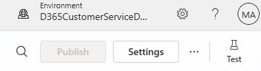
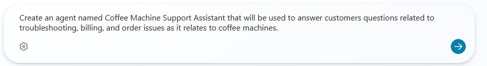
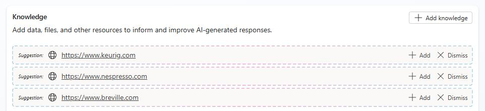
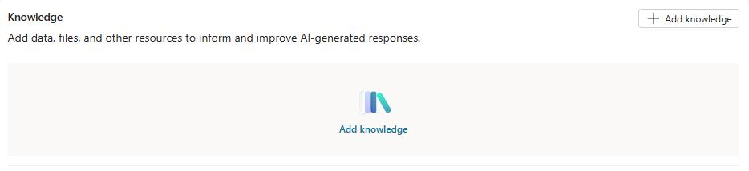
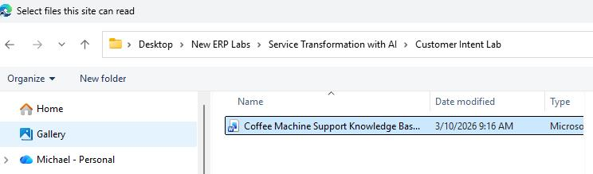
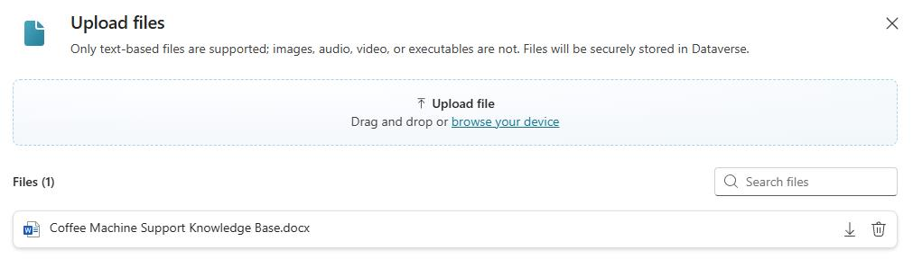
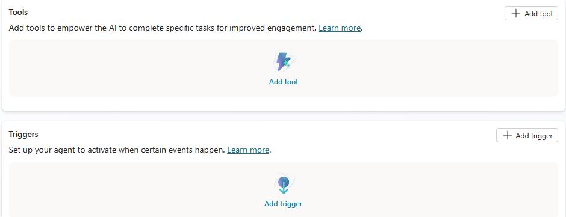

## Task 01: Create an agent


{: .warning }
> Copilot Studio is evolving at a rapid rate. Your experience may differ from the instructions. During testing, Copilot Studio suggested knowledge sources, tools, and triggers for the agent. You will remove all of the suggestions.

1. In Edge, go to `https://copilotstudio.microsoft.com/`.

1. At the top right of the page, select your demo environment.

    

1. In the left pane, select **Agents**.

	

1. In the **Start building by describing what your agent needs to do** text field, enter the following information:

	```
    Create an agent named Coffee Machine Support Assistant that will be used to answer customers questions related to troubleshooting, billing, and order issues as it relates to coffee machines.
    ```

	

    {: .note }
    > It may take a couple of minutes for the agent to be provisioned. 

1. Move down to the **Knowledge** section. 

	

1. For each suggested knowledge source, select **Dismiss**.

	

1. Select **+ Add knowledge**.

1. In the **Upload file** area, select **select to browse**.

    

1. Go to the location where you saved all of the files that you downloaded from GitHub in the prerequisite lab. In the **Customer Intent Lab** folder, select **Coffee Machine Support Knowledge Base.docx** and then select **Open**.

	

1. Select **Add to Agent**.

    
    

1. In the **Tools** section and the **Triggers** sectio, dismiss any suggestioins.

	

1. Leave the agent page open. You will perform additional configuration steps in the next task.
