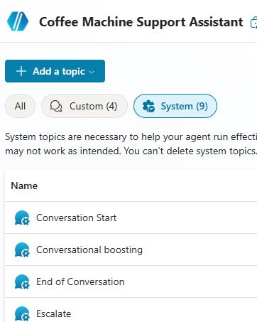
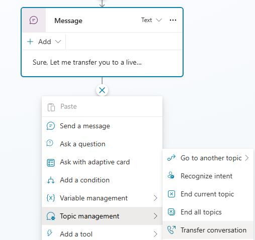
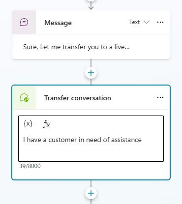
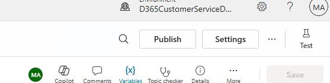
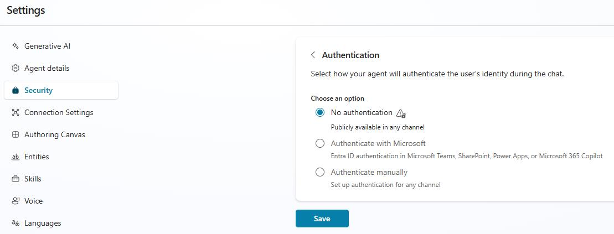
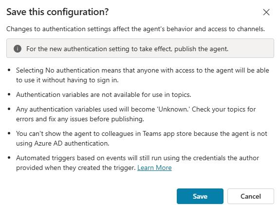
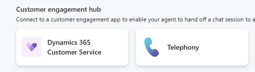
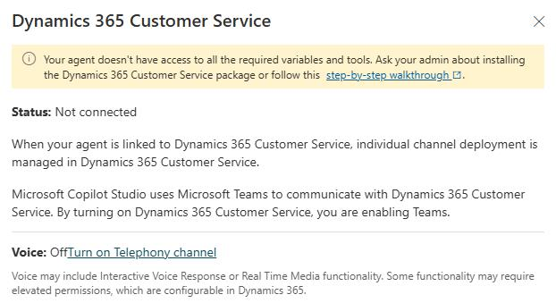
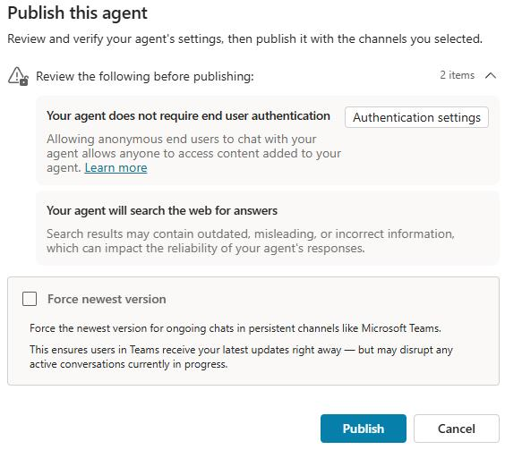

## Task 02: Configure the agent's security and connect to Dynamics 365


When the agent cannot assist the customer in finding a resolution, it needs to be able to hand it off to a live representative so they can continue assisting the customer. Next, you're going to create a connection to Dynamics 365 and ensure that there is no authentication needed for the agent.  This is not how it would be done in a real deployment, but to ensure you can tell the most effective story to the customer, you're going to leave authentication off for this use case.


1. On the command bar for the agent, select **Topics**.

	

1. Select **System** and open the **Escalate** topic.

    

1. Locate the **Message** node, and change the message text to: 

    ```
    Sure, Let me transfer you to a live representative now.
    ```

1. Below the **Message** node, select **Add node** (**+**). Then, in the **Topic Management** group, select **Transfer conversation**.

    

1. In the **Transfer Conversation** node, enter the following text: 

    ```
    I have a customer in need of assistance
    ```

    

1. On the command bar, select **Save**.

	

1. On the command bar, select **Settings**.

    

1. In the **Security** group, select **Authentication** and then select **No Authentication**.

    

1. Select **Save**.

1. In the confirmation dialog, select **Save**.

	

1. On the command bar, select **Close** (**X**).

	

1. On the command bar, select **Channels**.

	

1. In the **Customer Engagement Hub** section, select **Dynamics 365 Customer Service**.

    

1. On the **Dynamics 365 Customer Service** pane, select **Connect**.

	
    
    

    {: .note }
    > Wait for the agent to be connected to Dynamics 365. This may take several minutes.

1. Close the **Dynamics 365 Customer Service** pane.

1. On the command bar, select **Publish**.

    

1. In the confirmation dialog, select **Publish**.

	
