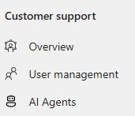
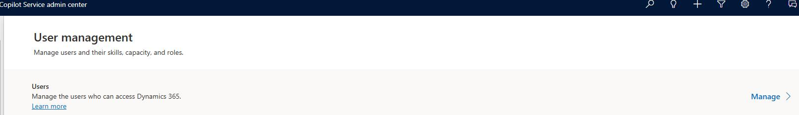
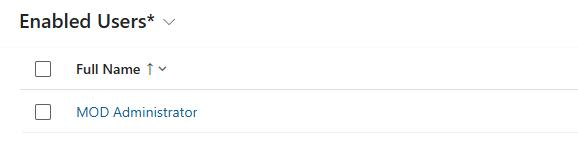
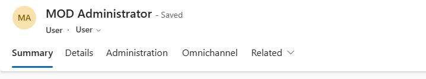
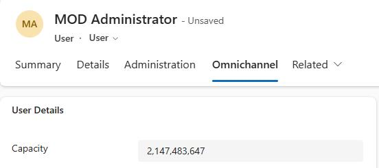
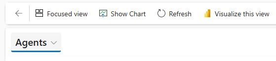
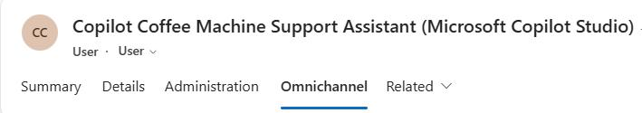
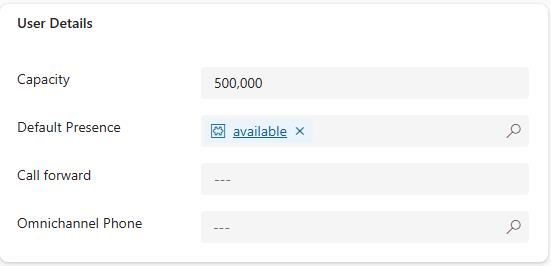

## Task 03: Configure capacity

When it is time for you to demonstrate the functionality, it is possible that the agent will not route conversations to you as it should. This is generally because when AI Agents are created they automatically have more capacity assigned to them than your demo account probably does.

To ensure that this does not cause any issues, you're going to ensure that your admin/demo account has more capacity assigned to it.

1. Open the **Copilot Service admin center** app.

	

1. In the left pane, in the **Customer support** section, select **User Management** .

	

1. On the **User Management** page, locate **Users** and then select **Manage**.

	

1. Search for and select the administrative account for your demo environment.

	

1. On the command bar, select **Omnichannel**.

	

1. In the **User Details** tile, in the **Capacity** field, enter `2,147,483,647`.

	

1. On the command bar, select **Save and Close**.

	

    {: .warning }
    > Changes to the Omnichannel configuration can take 15 minutes to propogate through the system and become effective.

1. At the top left of the page, select **Enabled Users** and change the value to **Agents**.

	
	
1. In the list of agents, select **Copilot Coffee Machine Support Assistant**.

	

1. On the command bar, select **Omnichannel**.

	

1. In the **User Details** tile, in the **Capacity** field, enter `500,000`.

	

1. On the command bar, select **Save and Close**.