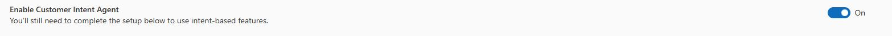

## Task 01: Enable the Customer Intent agent

1. Open the **Copilot Service admin center** app.

	

1. In the left pane, in the **Customer support** section, select **Intent**. 

	

1. Select **Enable Customer Intent Agent**. 
 
    {: .warning }
    > It can take up to 15 mins for the agent to be enabled and ready for configuration.

    

{: .warning }
> The demo hub template that you provisioned includes several intents and intent groups.  Additionally intent discovery is disabled. This is by design.  When you run intent discovery it will remove any intents that are already there. This way you do not delete any of the Intent and Intent Groups related to Contoso coffee.