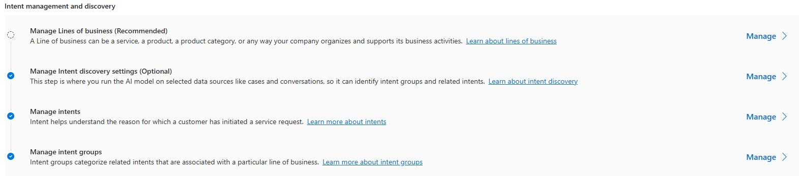

## Task 02: Verify that required intents and intent groups are present.

1. Open the **Copilot Service admin center** app.

	

1. In the left pane, in the **Customer support** section, select **Intent**. 

	

1. Locate **Manage intent Groups** and then select **Manage**.

	

1. On the **All intents groups** page, verify that you see the following groups:

    - Account and Billing Support
    - Coffee Machine Troubleshooting
    - Ordering and Delivery Issues
    - Product or Service Assistance
    - Subscription Issues

	{: .warning }
    > If all intent groups are present and they include intents, skip Task 03 and move to the next exercise.
    >
    > If you are missing the **Coffee Machine Troubleshooting**, complete Task 03.