## Task 03: Create an intent group and intents

---

### 01: Create an intent group and add an existing intent

1. On the command bar, select **+ New**.

	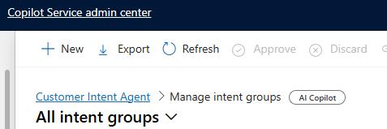

1. Configure the new intent group as follows.

    | Option | Value |
    | -------- | -------- |
    | Intent group name: | `Coffee Machine Troubleshooting` |
    | Description: | `Used to group together intents that are related to coffee machine troubleshooting.` |
    | Review Status: | **Approved** |

    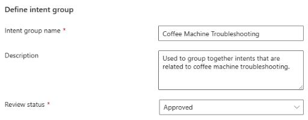

1. Select **Next**.

1. On the Add Intents screen, select **+ Add**.

	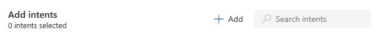

1. Select **Coffee grounds not dispensing** and then select **Add**.

	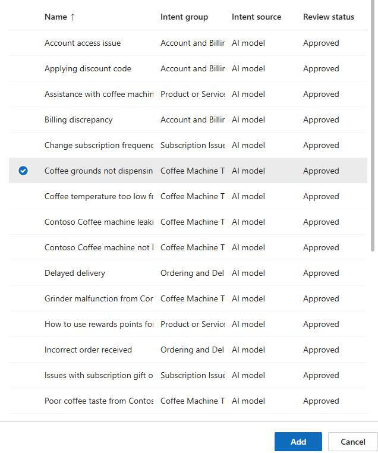

1. Select **Save**.

---

### 02: Create new intents

1. Open the **Copilot Service admin center** app.

	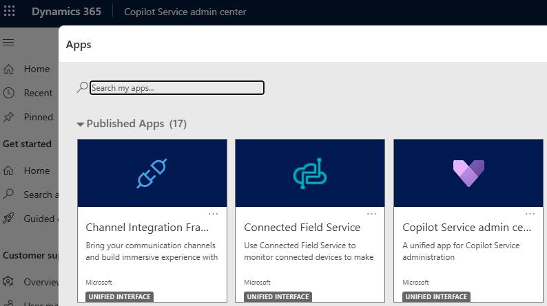

1. In the left pane, in the **Customer support** section, select **Intent**. 

	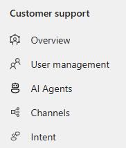

1. Locate **Manage intents** and then select **Manage**.

	

1. On the on the command bar, select **+ New**.

	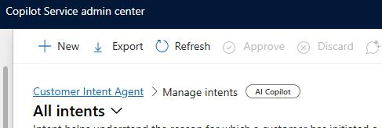

1. Configure the intent as follows:

    | Option | Value |
    | -------- | -------- |
    | Name: | `Contoso Coffee Machine LCD screen is not working` |
    | Review status: | `Approved` |
    | Intent group: | `Coffee Machine Troubleshooting` |

    

1. Select **Save**. Leave the intent page open.

1. Locate the **Attributes** section and then select **+ Add**.

	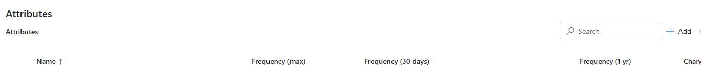

1. In the **Name** field, enter `Recent maintenance` and then select **Save**.

1. In the **Attributes** section, select **Add**. Then, in the **Name** field, enter `Model Number`.

    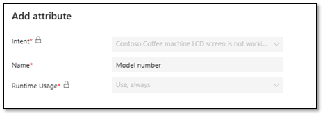

1. Select **Save**. Your completed **Contoso Coffee machine LCD screen is not working** intent should resemble the image below:

	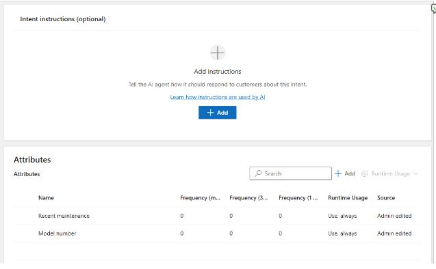

1. On the command bar, select **Save and Close**.

---

### 03: Modify existing intents

1. Under **Intents**, locate and select **Coffee grounds not dispensing from Contoso Coffee Machine** intent.

    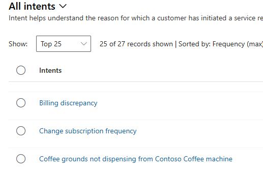

1. Select the **Cleaning Schedule, Error Code**, and **Machine Model** attributes.

	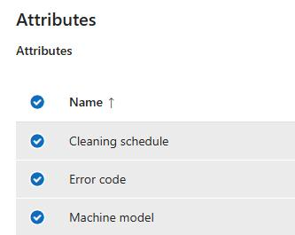

1. Select **Change Runtime Usage** and then select **Use, always**.

    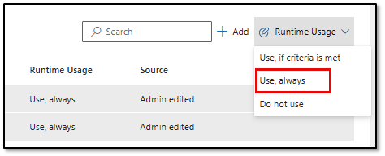

1. Select **Update**.

	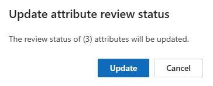

1. On the broswer command bar, select the back arrow to return to the **Intents** page.

	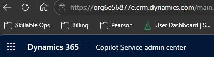

	
1. Locate and select the **Poor coffee taste from Contoso Coffee machine** intent.

    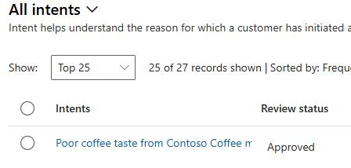

1. Select the **Change in coffee bean, Taste description, Filter condition**, and **Type of water used** attributes.

1. Select **Change Runtime Usage** and then select **Use, always**.

1. Select **Update**.
