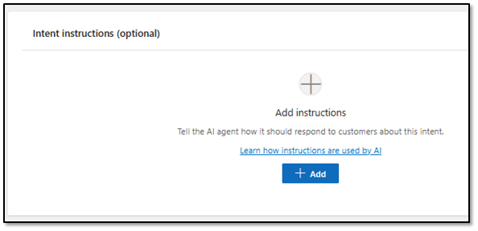
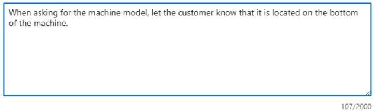
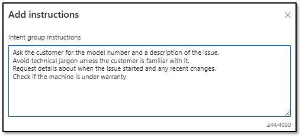
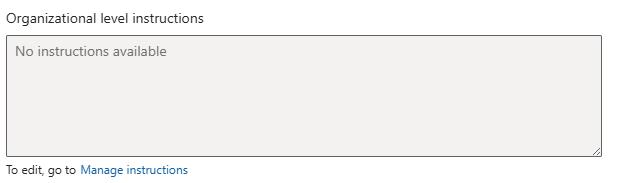
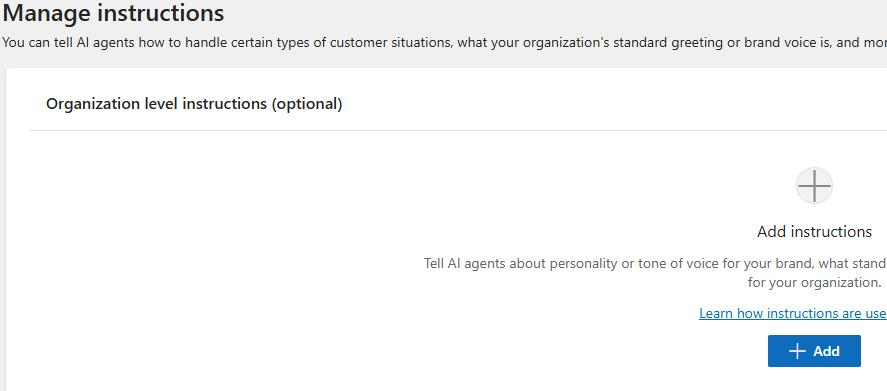

## Task 04: Define instructions


While they are considered optional, instructions can be critical aspect of intents. Without providing proper instruction, the representative and Dynamics 365 may not be able to diagnose the clients issue. Think of instructions as a script for the Customer Service Representative.

---

### 01: Define Intent instructions

1. Open the **Copilot Service admin center** app.

	

1. In the left pane, in the **Customer support** section, select **Intent**. 

	

1. Locate **Manage intents** and then select **Manage**.

	

1. Locate and open the **Contoso Coffee machine LCD screen is not working** intent that you created earlier.

1. In the **Intent instructions (optional)** section, select the **+ Add** button.

    

1. On the **Add instructions** below, in the **Intent Instructions** field, enter the follwoing text:

    ```
    Note: Instruct the customer that they can find the Model Number at the bottom of the machine.
    ```

1. Select **Save**.

    {: .note }
    > You may need to select the back arrow to leave intent.
    >
    > Now that you've designed the instructions for this topic, you're going to define some instructions for other intents.

1. Go to **Intents**.

1. Locate and open the **Coffee grounds not dispensing from Contoso Coffee machine** intent record.

1. In the **Intent instructions (optional)** section, select the **+ Add** button.

    

1. On the **Add instructions** below, in the **Intent Instructions** field, enter the follwoing text:

    ```
    Note: When asking for the machine model, let the customer know that it is located on the bottom of the machine.
    ```

	

1. Select **Save**.

1. On the **Coffee grounds not dispensing from Contoso Coffee machine** intent, select **Save and close**.

1. Go to **Intents**.

1. Locate and open the **Poor coffee taste from Contoso Coffee machine** intent record.

1. In the **Intent instructions (optional)** section, select the **+ Add** button.

    

1. On the **Add instructions** screen, enter the text below to in **Intent Instructions** field.

    ```
    Question 1
    - Ask if the water reservoir is filled and seated properly.
    - If yes, move to Question 3.
    - If no, advise them to fill the reservoir to capacity, and ensure that it is seated properly.

    Question 2
    - Ask them to run a Descaling Cycle

    **Question 3
    - Ask them If there is a humming or vibration when the machine tries to dispense.
    - If yes, Look for Solution.
    - If no, Look for Solution.
    ```

1. Select **Save**.

1. On the **Poor coffee taste from Contoso Coffee machine** intent, select **Save and close**.

---

### 02: Define Intent group and organizational level instructions

In addition to adding instructions to individual intents, you can define instructions at an Intent Group level. These might include company policies related to this intent group.

You can define instructions at an organization level. These might include company policies such as how to greet customers, the personality and tone that should be used.

1. Open the **Copilot Service admin center** app.

	

1. In the left pane, in the **Customer support** section, select **Intent**. 

	

1. Locate ** Manage Intent Groups** and then select **Manage**.

	

1. Select the **Coffee Machine Troubleshooting** intent group.

1. In the **Intent instructions (optional)** section, select the **+ Add** button.

    

1. In the **Intent group instructions** field, enter the following instructions:

    ```
    Ask the customer for the model number and a description of the issue.
    Avoid technical jargon unless the customer is familiar with it.
    Request details about when the issue started and any recent changes.
    Check if the machine is under warranty.
	```

    


1. Below the **Organization level instructions** field, select **Manage instructions**

	

1. On the **Organization level instructions** tile, select **+ Add**.

	


1. In the **Organization level instructions** field, enter the following instructions and then select **Save**:

	```
    Contoso coffee representatives should always be friendly and empathetic, Make sure you greet them with Welcome to Contoso Coffee, how can I be of assistance?
    ```

1. Select **Save**.