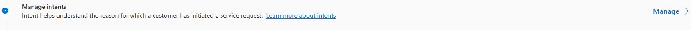
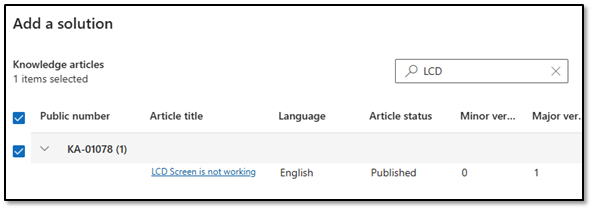
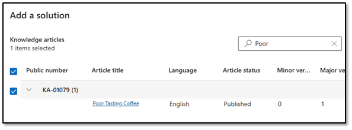

## Task 05: Configure solutions

One of the key advantages of the Customer Intent Agent is the ability to associate possible solutions with an intent. These solutions can be things like Knowledge Articles, Agents, and more. In this task, you're going to add some solutions to a few intents.

1. Open the **Copilot Service admin center** app.

	

1. In the left pane, in the **Customer support** section, select **Intent**. 

	

1. Locate **Manage Intents** and then select **Manage**.

	

1. Open the **Contoso Coffee Machine LCD screen** is not working intent that you created earlier.

1. Move down to the **Solutions (Optional)** section, ensure that **Dynamics 365 knowledge articles is selected**, and then select **+ Add**.

1. Select the **LCD Screen is not working** article you created earlier.

    

1. Select **Save and Close**.

1. On the **Customer Intent Agent (preview)** page, select **Manage** next to **Manage intents**.

1. Open the **Poor Coffee taste from Contoso Coffee machine** intent that you created earlier.

1. Move down to the **Solutions (Optional)** section, ensure that **Dynamics 365 knowledge articles** is selected, and then select **+ Add**.

1. Select the **Poor Tasting Coffee** article you created earlier.

    

1. Select **Save and Close**.