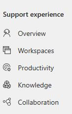
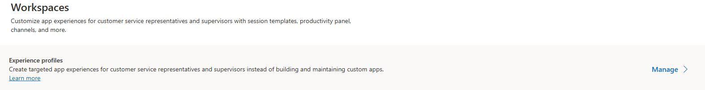
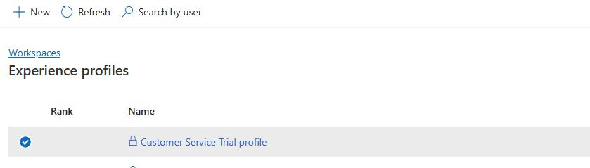
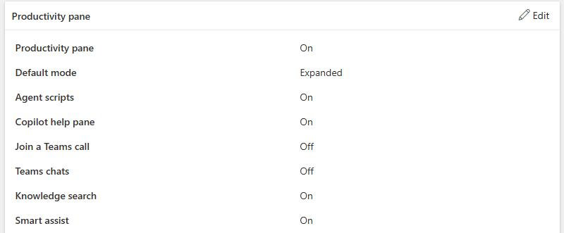
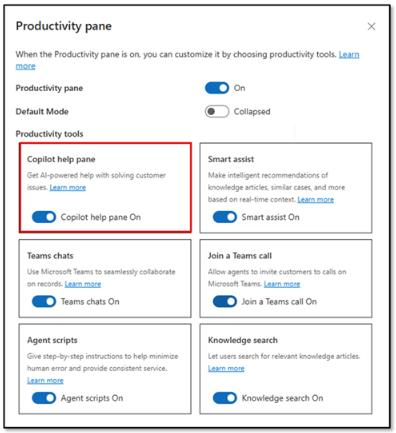
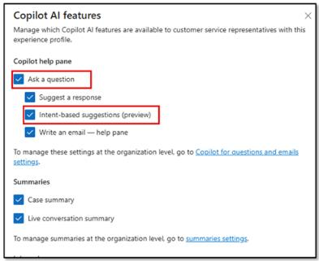

## Task 01: Enable intent-based suggestions for service representatives

In this task, you'll add the Copilot features to an experience profile.

1. Open the **Copilot Service admin center** app.

	

1. In the left pane, in the **Support experience** section, select **Workspaces**. 

	

1. Locate **Experience profiles** and then select **Manage**.

	

1. In the list of experience profiles, select **Customer Service Trial profile**.

	

1. On the **Productivity pane** trial, select **Edit**.

	

1. On the **Copilot help pane** tile, set **Copilot help pane On** to **On**.

	

1. On the **Customer Service Trial profile** page, on the **Copilot AI features** tile, select **Edit**.

1. Select the following options:

    - **Ask a question**.
    - **Intent-based suggestions (preview)**.

	

1. Select **Save and Close**.