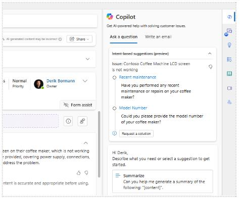
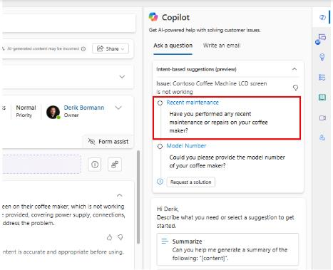
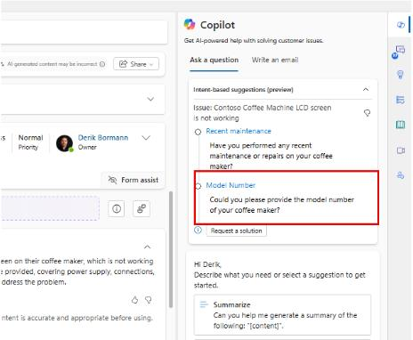
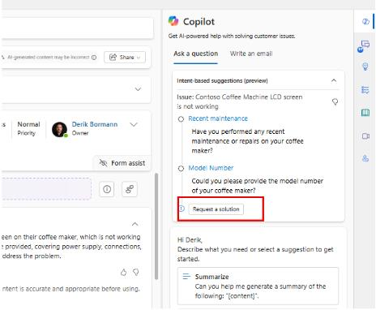

## Task 02: Demonstrate the agent experience

You'll now switch to the agent experience so you can use the Customer Intent Agent.

1. Open the **Customer Service workspace** app.

1. Sign in as a user with the **Customer Service Representative** role.

1. From the Home screen, wait for an incoming conversation. 

    {: .note }
    > This can be from any channel that you configured for this demo, such as chat, voice, or WhatsApp.

1. Wait for the notification of an incoming conversation to appear when it does select the **Accept** button.

1. The conversation opens in a new session tab.

    Once the conversation is open, here are some helpful elements that you can call out as part of the initial tour.

    - **Session Tabs**: Each interaction opens in its own tab.
    - **Customer Summary Panel**:
        - Contact details
        - Recent cases
        - Entitlements
    - **Conversation Panel**:
        - Call out the transcript and how the complete conversation history is displayed.
        - Agent input box
        - Real-time sentiment analysis
        - Quick replies
    - **Copilot Panel (right side)**:
        - **Copilot** suggestions
        - **Ask copilot questions.**
        - **Case Management Agent** insights

    > After your tour, continue you talk track from the Agents perspective.

1. Using the **Productivity Pane** on the right, wait for a blue circle to appear next to the **Copilot** icon, then select the **Copilot** Icon.

1. Notice that your **Intent Agent** displays and prompts for answers to the attributes you defined.

	

1. Select the **question about performing any recent maintenance or repairs**, then select **Send**.

	

1. Wait for the customer to respond.

1. Select the **Model Number Question**, and wait for the customer to respond.

	

1. Select the **Request a Solution** button.

1. The Knowledge article you created earlier will be provided.

	

1. Additionally, demonstrate what happens when the customer indicates a different issue such as a grinder problem.