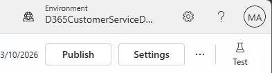
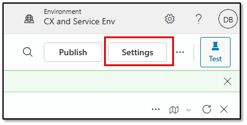
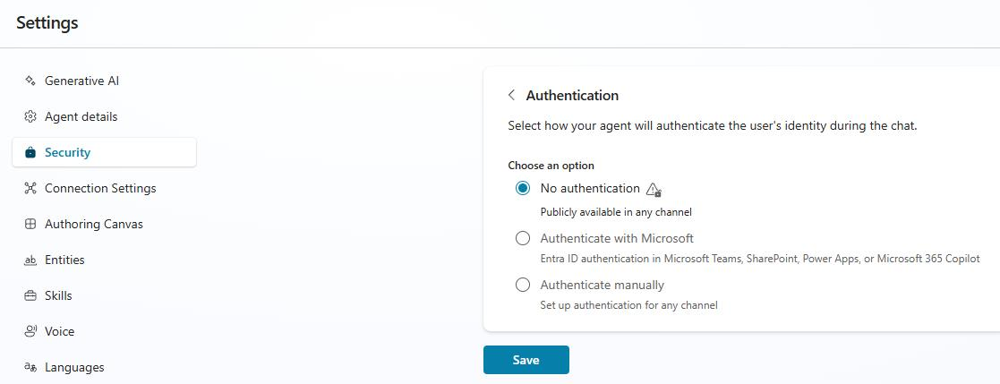

## Task 01: Create an agent


In this exercise, you're going to create a different agent. You'll create a new agent that can answer using general web knowledge, and you'll also connect it to Dynamics 365 so it can surface intent-based suggestions to guide the conversation.

1. In Edge, go to `https://copilotstudio.microsoft.com/`.

1. Select your demo environment.

    

1. In the left pane, select **Agents**.

1. Select **New Agent**.

1. Enter the following information to describe the agent you want to create:

	```
    Create an agent named Intent Coffee Support Assistant that will be used to answer customers questions related to troubleshooting, billing, and order issues as it relates to coffee machines.
    ```

1. Select **Send**.

    {: .warning }
    > Wait for the agent to be created.In this agent. This may take several minutes.
    >
    > You're not going to add any knowledge directly to the agent. The agent will use general knowledge from the internet and will also use the intents you created. 

1. On the command bar for the **Intent Coffee Support Assistant** agent, select **Settings**.

    

1. On the **Security** page, in the **Authentication** section, select **No Authentication**.

    

1. Select **Save**. 

1. In the confirmation dialog, select **Save**.

1. Close the **Settings** page.

1. On the command bar for the agent, select **Publish**.

1. In the confirmation dialog, select **Publish**.