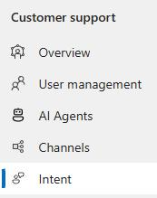
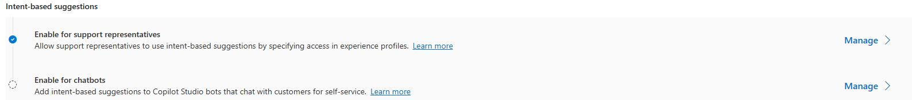
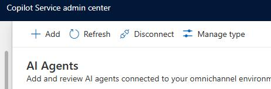
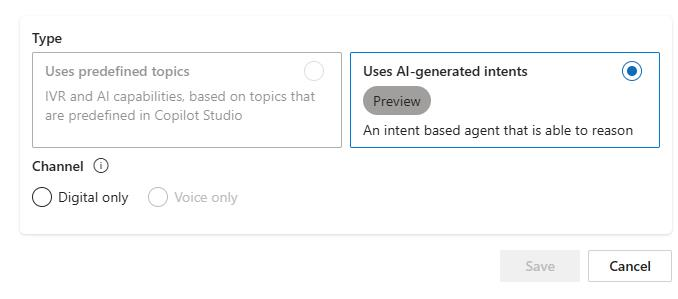

## Task 02: Set up Copilot agents for intent management

1. Open the **Copilot Service admin center** app.

	

1. In the left pane, in the **Customer support** section, select **Intent**. 

	

1. In the **Intent-based suggestions** section, locate **Enable for chatbots** and then select **Manage**. 

	

1. Select the **Intent Coffee Support Assistant** you created earlier. Then, on the command bar, select **Manage type**.

	

1. Select **Uses AI-generated intents**.

	

1. Select **Digital only** and then select **Save**.