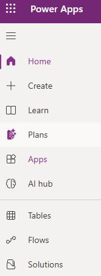
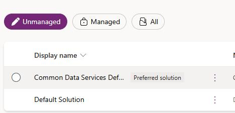
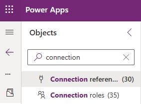
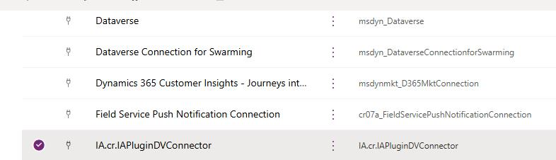

## Task 03: Add connection references

Add connection references for each new organization once, even if you add multiple agents to the organization. 

1. In Edge, so to `make.powerapps.com` and select your environment.

1. In the left pane, select **Solutions**.

	

1. Select **Default Solution**.

	

1. In the **Objects** pane, select **Connection References**.

	

1. Search for and select the **IA.Cr.IAPluginDVConnector** connection reference.

	

1. Ensure that the connection uses the administrative credentials for your demo environment.

1. Close the connection pane.